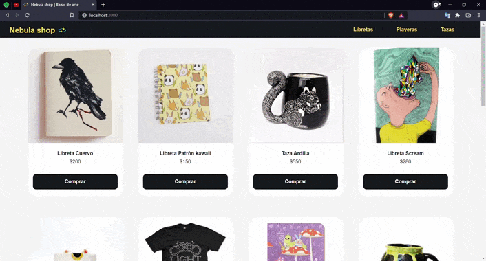

# Nebula shop | Bazar de arte

Ecommerce realizado con react js con productos en venta como: libretas, playeras y tazas.

.

## Cómo ver el proyecto en línea

El proyecto se encuentra desplegado en github pages en el siguiente enlace: [https://edithort.github.io/nebula-shop-ortiz/](https://edithort.github.io/nebula-shop-ortiz/)

## `npm start`

Ejecutar `npm start` para iniciar el proyecto de forma local.

## Dependencias

Para instalar todas las dependecias ejecutar en terminal `npm install`

### Moment js

Uso de moment js para dar formato de MM/DD/AA a la fecha en la que se genera la orden y ya tenerla canalizada así en la base de datos Firebase ya que en el futuro se tiene planteado mostrar esta información como detalle de la compra del usuario.

[Enlace](https://github.com/moment/moment/ "Repositorio moment js")

### Sass

Sass como lenguaje para hojas de estilos, así mismo para el ordenamiento de mis archivos .scss por componentes importandolos en el index.scss.

[Enlace](https://github.com/sass/sass "Repositorio sass")
